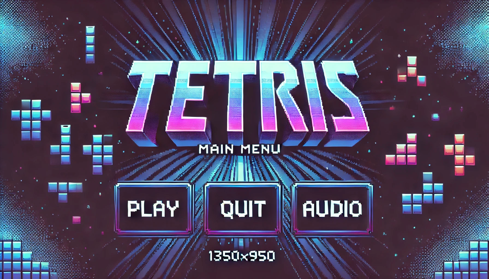

# 2-Player Tetris Game

A 2-Player Tetris game built using C++ and the [Raylib](https://www.raylib.com/) library. This project features both single-player and local multiplayer modes, custom audio tracks, and a fully functional UI system.

## 🎮 How to Play (The Easy Way)
If you just want to play the game without setting up any coding tools:
1. Open the **`2-Player-Game-Ready-To-Play`** folder.
2. Double-click the `.exe` file inside.
3. Enjoy!

---

*The sections below are for developers who want to compile or modify the code.*

## Prerequisites (Windows)

To build and run this game locally on Windows, you will need the standard Raylib environment setup:
1. Download and install **Raylib** for Windows (typically installed to `C:\raylib\`).
2. This project expects the Raylib library to be located at `C:\raylib\raylib` and the Mingw-w64 compiler toolkit at `C:\raylib\w64devkit`.
3. **Visual Studio Code** with the C/C++ extension installed.

## How to Compile and Run

This project uses a VS Code workspace configured for the Raylib environment.

1. **Open the Workspace:** Double-click on the `main.code-workspace` file to open the project in VS Code.
2. **Open the Main File:** In the VS Code Explorer, navigate to the `src` folder and open `TetrisSecondAttempt.cpp`.
3. **Compile & Run (The Easy Way!):** 
   - Simply press **`F5`** on your keyboard while `TetrisSecondAttempt.cpp` is open.
   - VS Code will automatically compile the code and then launch the game with the debugger attached.

### What is the difference between F5 and Ctrl+Shift+B?
- **`F5` (Start Debugging):** This is the all-in-one button. When you press F5, VS Code looks at `.vscode/launch.json`. This file has a property called `"preLaunchTask": "build debug"`. This tells VS Code to automatically run the build task *before* it launches your newly compiled `.exe` file. It's the most convenient way to quickly test your code!
- **`Ctrl + Shift + B` (Run Build Task):** This command *only* compiles the code using the `Makefile` (creating the `.exe` file). It does not automatically run the game afterward. You would use this if you just want to build a version of your game without actually launching it immediately.

## Controls
- **Player 1 Controls:** `W`, `A`, `S`, `D` to move, `E` and `Q` to rotate.
- **Player 2 Controls:** `I`, `J`, `K`, `L` to move, `U` and `O` to rotate.

## Audio & Assets
All textures and graphics are located in the `Graphics` folder, and the music tracks are in the `Sounds` folder. You can change the music from the in-game Audio menu.

## Images
*(Add your screenshots of the Main Menu, Audio Settings, and Gameplay here!)*

<!-- Example of how to add an image: -->
<!--  -->
